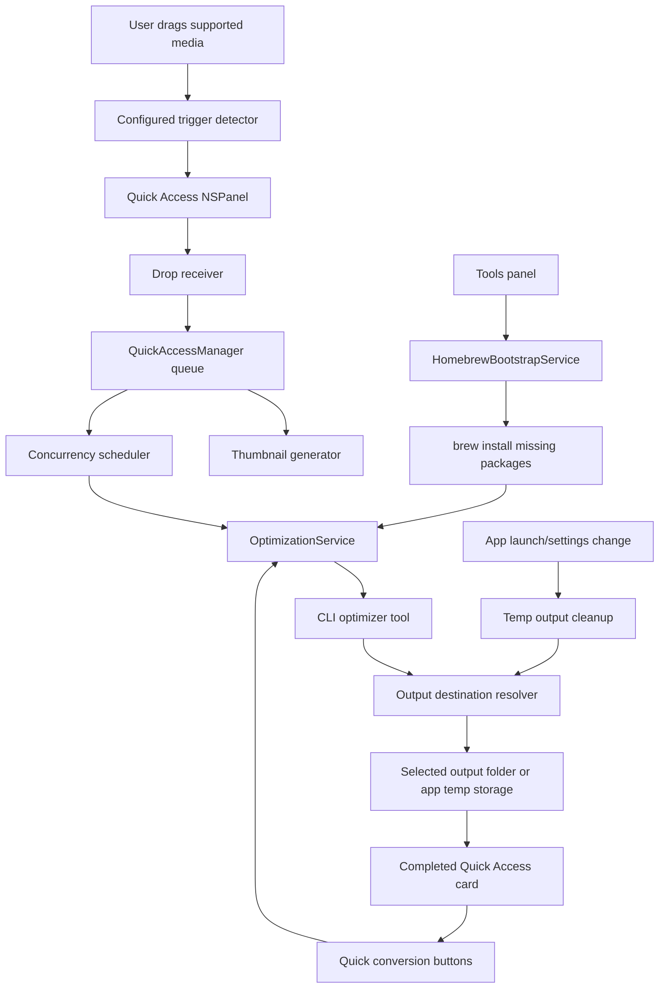

# Project Structure

This doc mirrors current Compresso code, not the old Snapzy source docs.

## Runtime Map



## Source Tree

```text
Compresso/
  App/
    AppDelegate.swift
    CompressoLaunchView.swift

  Features/
    Home/
      Components/
        WorkspaceConfigLayout.swift
        WorkspaceConfigurationPane.swift
        WorkspaceDropZonePane.swift
        WorkspaceFileCell.swift
        WorkspaceQualitySection.swift
        WorkspaceWindowConfigurator.swift
      Models/
        CompressoWorkspaceMetrics.swift
        CompressoWorkspaceViewStyle.swift
      ContentView.swift

    Onboarding/
      OnboardingPermissions.swift
      OnboardingStep.swift
      OnboardingToolSetupView.swift
      OnboardingView.swift

    OutputSettings/
      OutputSettingsView.swift

    Settings/
      CompressoSettingsDetailView.swift
      CompressoSettingsSection.swift
      CompressoSettingsSharedViews.swift
      CompressoSettingsSidebarView.swift
      GeneralSettingsView.swift
      InfoSettingsView.swift
      QuickAccessSettingsView.swift
      ToolsSettingsView.swift

    QuickAccess/
      Components/
        QuickAccessCardView.swift
        QuickAccessDropReceiverView.swift
        QuickAccessDropZoneCardView.swift
        QuickAccessExternalDragSource.swift
        QuickAccessStackView.swift
      Managers/
        QuickAccessManager.swift
        QuickAccessPanelController.swift
      Models/
        QuickAccessModels.swift
      Services/
        QuickAccessAnimations.swift
        QuickAccessShakeDetector.swift
        QuickAccessThumbnailGenerator.swift
      Styles/
        QuickAccessPresentationStyle.swift
        QuickAccessStackPresentationStyle.swift
      QuickAccessPanel.swift

  Services/
    Optimization/
      OptimizationOutputSettings.swift
      OptimizationQualitySettings.swift
      OptimizationService.swift
      OptimizationTemporaryFileStore.swift
    Updates/
      UpdaterManager.swift

  Support/
    CompressoCompatibility.swift
    ScreenUtility.swift

  Resources/
    Info.plist

  ContentView.swift
  CompressoApp.swift
  build_and_run.sh
  bump-version.sh
  create-signing-cert.sh
  generate-changelog.sh
  test-update-local.sh
  update-appcast.sh
  update-changelog.sh

docs/
  STRUCTURE.md
  DESIGN_TOKENS.md
  RELEASES.md
  UPDATE_TESTING.md

.codex/
  environments/
    environment.toml
```

## Feature Roots

| Path | Owns |
| --- | --- |
| `App/` | App lifecycle, first-run launch gate, and launch-time service bootstrap |
| `Features/Onboarding/` | First-run welcome, required optimizer tool setup, optional permission setup, and completion transition |
| `Features/Settings/` | Main System Settings-style configuration shell, sidebar, detail pages, shared grouped rows |
| `Features/OutputSettings/` | Output destination toggle, folder picker, temp retention controls |
| `Features/QuickAccess/` | Floating Quick Access presentation styles, placeholder card, drag/drop, card visuals, trigger detection |
| `Services/Optimization/` | Local CLI tool resolution, Homebrew bootstrap, output destination resolution, temp cleanup, optimizer process execution |
| `Services/Updates/` | Sparkle updater ownership, manual update checks, and update lifecycle logging |
| `Support/` | Small platform helpers and macOS version compatibility wrappers |
| `docs/DESIGN_TOKENS.md` | Shared visual tokens and state treatment |

## Onboarding Flow

1. `CompressoApp` opens the main `WindowGroup`.
2. `CompressoLaunchView` reads `onboarding.isComplete` from `@AppStorage`.
3. The main window disables restoration so onboarding starts from the default 920 x 680 launch size instead of a stale saved frame.
4. If onboarding is incomplete, `OnboardingView` fills the window with a transparent native material surface and hides the toolbar/header.
5. Onboarding content is centered in a scrollable region with finite minimum window sizing, so smaller windows scroll content instead of forcing height.
6. The visible step sequence is Welcome, Install dependencies, optional Permissions, then Ready.
7. The Permissions step is omitted when `OnboardingPermissions.requirements` is empty.
8. Install dependencies uses `HomebrewBootstrapService.missingTools()` and blocks Continue until all optimizer tools are ready.
9. If Homebrew is available, the dependency step installs missing packages through a large circular progress control backed by the existing Homebrew bootstrap service.
10. The dependency progress center shows installed count before setup, package progress while installing, and Done at 100%.
11. While dependencies are missing, the footer primary button changes from Continue to Install and triggers the same setup action as the circular progress control.
12. After all dependencies are installed, the footer primary button returns to Continue.
13. The dependency list renders as a paragraph with each open-source optimizer name linked to its project.
14. If Homebrew is unavailable, the dependency step links to Homebrew, lets the user refresh after setup, and still supports manually installed tools.
15. A bottom-center dot indicator shows the current step while Back and Continue remain native footer controls.
16. The content is centered in the window; there is no onboarding sidebar or step rail.
17. The Ready step previews Quick Access by animating image and video chips with a pointer cue into a raised drop placeholder, then into a non-overlapping clipped vertical processing stack.
18. Completing onboarding sets `onboarding.isComplete` and swaps the window into the post-onboarding action menu.
19. `ContentView` calls `QuickAccessManager.start()` on appear as an idempotent fallback after first-run onboarding completes.

## Quick Access Flow

1. `AppDelegate` performs launch activation, expired temporary output cleanup, and starts `QuickAccessManager` when onboarding is complete.
2. `ContentView` also calls `QuickAccessManager.start()` after onboarding transitions into the settings window, so the listener starts in the same session after first-run setup.
3. `QuickAccessManager` listens to local/global drag events.
4. `QuickAccessManager` checks the active drag pasteboard for supported optimizer payloads, then evaluates the configured trigger interaction.
   Default is shake via `QuickAccessShakeDetector`; hold starts a timer using the configured delay.
   The same lightweight pasteboard pass also records a pending drop summary such as `4 Images` for presentation styles that show aggregate drag context.
5. `QuickAccessPanelController` asks the configured `QuickAccessPresentationStyle` for panel metrics and shows a non-activating floating `NSPanel`.
6. The panel position combines top/bottom edge with left/center/right alignment.
   Bottom placement anchors the stack to the lower edge and grows upward; top placement enters from the upper edge, anchors high, and grows downward.
   Top placement compensates for menu/notch safe area so the visual inset to the nearest Quick Access card edge matches bottom placement.
7. The placeholder stays pinned while the drag session is active.
8. If the user releases without dropping, the placeholder hides after a short grace period.
9. `QuickAccessDropReceiverView` caches pasteboard eligibility by `changeCount` during drag updates and avoids reading large inline data until drop.
10. On drop, `QuickAccessDropReceiverView` reads file URLs or image/PDF pasteboard data.
11. `QuickAccessManager` immediately inserts queued cards with placeholder thumbnails so the panel responds before thumbnail work finishes.
12. `QuickAccessThumbnailGenerator` builds image, PDF, and video thumbnails off the main path; video previews use `AVAssetImageGenerator`.
13. The concurrency scheduler starts up to the configured number of optimization jobs.
14. Extra jobs remain queued until an active job completes, fails, or is removed.
15. Removing a processing card cancels the Swift task and terminates the active optimizer process.
16. `OptimizationService` resolves the current output destination.
17. If Save location is on, output writes to the selected folder.
18. If Save location is off, output writes to Compresso app temp storage.
19. Temp outputs expire after the configured retention period, defaulting to 1 day and capped at 90 days.
20. Supported image and video cards show XS conversion buttons under the card.
21. Image conversion targets are PNG, JPEG, WebP, and HEIC.
22. Video/GIF conversion targets are GIF, MOV, and MP4.
23. Conversion actions always read `QuickAccessItem.sourceURL`, not the optimized output URL, so repeated switches do not chain from a compressed/downscaled derivative.
24. Swipe a Quick Access result card left or right to dismiss that card.
25. Drag any Quick Access stack card with an available file away from its dismiss direction to drop it into external apps.
    Completed stack cards drag their optimized or converted output when it exists; staged, queued, processing, and failed stack cards drag the original source file.
26. External drag uses file URL pasteboard payloads for broad Finder, native app, and browser compatibility.
    Stack overflow drags all available item files together.
27. Double-click a card to open the optimized or converted output, falling back to the source file when output is unavailable.
28. Completed Quick Access cards stay visible for the configured result-card duration, defaulting to 15 seconds; selecting Never keeps them visible until removed.
29. When enabled in Quick Access settings, each finished optimized output file is copied to the system clipboard.
30. The Stack presentation shows the newest cards plus an overflow summary when the queue is larger than the panel should display.
31. Quick Access presentation owns visible item selection, panel size, active hit region height, outer shadow margin, and SwiftUI root view.

Output destination, internal temporary folder access, and retention are changed from the Settings window Output configuration.
Parallel job count is changed from the Settings window Concurrency configuration.

## Home and Settings UI

1. `ContentView` owns the post-onboarding settings shell and starts `QuickAccessManager`.
2. On macOS 13 and newer, `CompressoModernSettingsRoot` uses `NavigationSplitView`; on macOS 11-12, `CompressoLegacySettingsRoot` uses an `HStack` sidebar/detail fallback.
3. `ContentView` gives the settings window an 860 x 760 ideal content size with an 860 x 560 minimum size so common detail pages are visible on open without letting fixed settings rows clip horizontally.
4. `CompressoSettingsSidebarView` renders the native source-list sidebar, including standalone About plus grouped Settings and Tool sections, and filters sections with an AppKit `NSSearchField`.
5. `CompressoSettingsDetailView` switches between detail pages based on `CompressoSettingsSection`.
6. `CompressoSettingsPage` provides the shared heading plus scroll layout for every detail page.
7. `CompressoSettingsGroup`, `CompressoSettingsControlRow`, `CompressoSettingsValueRow`, and `CompressoSettingsAlignedRow` provide the shared native settings row treatment.
8. `InfoSettingsView` About is the default standalone landing page.
9. `QuickAccessSettingsView` owns Quick Access style, trigger, placement, after-processing, preview, and concurrency controls.
10. `OutputSettingsView` owns save location, destination folder, internal temporary folder reveal, temp retention, and conversion output behavior.
11. `ToolsSettingsView` owns optimizer status and Homebrew install action.

## Homebrew Bootstrap Flow

1. `ToolsSettingsView` renders optimizer availability from `OptimizationTool.catalog`.
2. `HomebrewBootstrapService` checks for `brew` in the local tool search paths.
3. If tools are missing, the Tools panel install action runs:

```text
brew install <missing-packages>
```

4. During install, callers can receive package-level progress for onboarding/status UI.
5. After install completes, the Tools panel refreshes availability state.

## Update Flow

1. `AppDelegate` touches `UpdaterManager.shared` during launch so Sparkle starts once.
2. `UpdaterManager` owns the only `SPUStandardUpdaterController`.
3. The app menu and About page call `UpdaterManager.shared.checkForUpdates()`.
4. Sparkle reads `SUFeedURL` and `SUPublicEDKey` from the built app `Info.plist`.
5. The public appcast lives at repo root as `appcast.xml`.
6. Release publish signs the DMG with the Sparkle EdDSA private key and writes the signature into the appcast item.
7. Release publish compares the candidate app designated requirement against the previous release before publishing.
8. Signing identity changes and Sparkle key changes are blocked by default because they can strand existing installations.
9. Compresso remains non-sandboxed in this phase because optimizer CLI execution depends on the current non-sandboxed runtime model.

## Optimizer Mapping

| Input | Tool | Homebrew package |
| --- | --- | --- |
| PNG | `pngquant` | `pngquant` |
| JPEG | `jpegoptim` | `jpegoptim` |
| GIF | `gifsicle` | `gifsicle` |
| Video | `ffmpeg` | `ffmpeg` |
| PDF | `gs` | `ghostscript` |
| Other images | `vips` | `vips` |
| Image conversion | ImageIO framework, `vips` for WebP | Built in, `vips` |
| Video conversion | `ffmpeg` | `ffmpeg` |
| Video to GIF conversion | `gifski`, `ffmpeg` fallback | `gifski`, `ffmpeg` |
| GIF optimization | `gifsicle` | `gifsicle` |

## Notes

- The app intentionally disables App Sandbox for now so local optimizer binaries can execute.
- Missing optimizer binaries surface as failed Quick Access cards.
- Save location is off by default. Temp output storage lives under `~/Library/Application Support/Compresso/Temporary Outputs/`.
- App launch and retention changes trigger cleanup for expired temp outputs and inline dropped-source temp files.
- MOV/MP4 conversion tries stream-copy remux first to avoid quality loss, then falls back to high-quality H.264/AAC transcode if the source container or codecs cannot be copied.
- Optimizer stderr is written to a temporary log file instead of an undrained pipe, preventing verbose tools from blocking on full process pipes.
