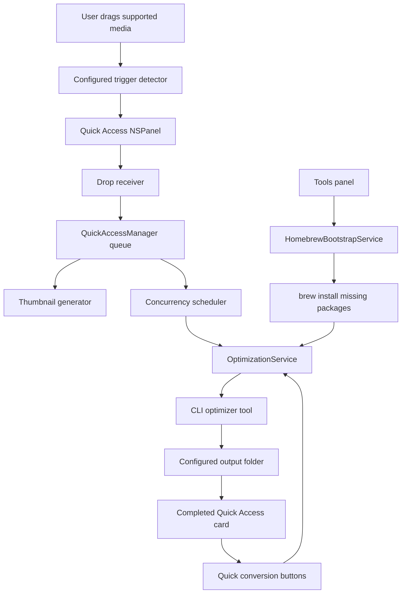

# Project Structure

This doc mirrors current Droplit code, not the old Snapzy source docs.

## Runtime Map



## Source Tree

```text
Droplit/
  App/
    AppDelegate.swift

  Features/
    QuickAccess/
      Components/
        QuickAccessCardView.swift
        QuickAccessDropReceiverView.swift
        QuickAccessDropZoneCardView.swift
        QuickAccessExternalDragSource.swift
        QuickAccessStackView.swift
      Managers/
        QuickAccessManager.swift
        QuickAccessPanelController.swift
      Models/
        QuickAccessModels.swift
      Services/
        QuickAccessAnimations.swift
        QuickAccessShakeDetector.swift
        QuickAccessThumbnailGenerator.swift
      QuickAccessPanel.swift

  Services/
    Optimization/
      OptimizationOutputSettings.swift
      OptimizationService.swift

  Support/
    ScreenUtility.swift

  ContentView.swift
  DroplitApp.swift

scripts/
  build_and_run.sh

docs/
  STRUCTURE.md
  DESIGN_TOKENS.md

.codex/
  environments/
    environment.toml
```

## Feature Roots

| Path | Owns |
| --- | --- |
| `App/` | App lifecycle and launch-time service bootstrap |
| `Features/QuickAccess/` | Floating stack, placeholder card, drag/drop, card visuals, trigger detection |
| `Services/Optimization/` | Local CLI tool resolution, Homebrew bootstrap, optimizer process execution |
| `Support/` | Small platform helpers |
| `docs/DESIGN_TOKENS.md` | Shared visual tokens and state treatment |

## Quick Access Flow

1. `AppDelegate` starts `QuickAccessManager`.
2. `QuickAccessManager` listens to local/global drag events.
3. `QuickAccessManager` checks the active drag pasteboard for supported optimizer payloads, then evaluates the configured trigger interaction.
   Default is shake via `QuickAccessShakeDetector`; hold starts a timer using the configured delay.
4. `QuickAccessPanelController` shows a non-activating floating `NSPanel`.
5. The panel position combines top/bottom edge with left/center/right alignment.
   Bottom placement anchors the stack to the lower edge and grows upward; top placement enters from the upper edge, anchors high, and grows downward.
   Top placement compensates for menu/notch safe area so the visual inset to the nearest Quick Access card edge matches bottom placement.
6. The placeholder stays pinned while the drag session is active.
7. If the user releases without dropping, the placeholder hides after a short grace period.
8. `QuickAccessDropReceiverView` caches pasteboard eligibility by `changeCount` during drag updates and avoids reading large inline data until drop.
9. On drop, `QuickAccessDropReceiverView` reads file URLs or image/PDF pasteboard data.
10. `QuickAccessManager` immediately inserts queued cards with placeholder thumbnails so the panel responds before thumbnail work finishes.
11. `QuickAccessThumbnailGenerator` builds real image/PDF thumbnails off the main path, while video thumbnails use async AVFoundation loading.
12. The concurrency scheduler starts up to the configured number of optimization jobs.
13. Extra jobs remain queued until an active job completes, fails, or is removed.
14. Removing a processing card cancels the Swift task and terminates the active optimizer process.
15. `OptimizationService` writes optimized output to configured output folder.
16. If no folder configured, output defaults to Desktop.
17. Supported image and video cards show XS conversion buttons under the card.
18. Image conversion targets are PNG, JPEG, WebP, and HEIC.
19. Video/GIF conversion targets are GIF, MOV, and MP4.
20. Conversion actions always read `QuickAccessItem.sourceURL`, not the optimized output URL, so repeated switches do not chain from a compressed/downscaled derivative.
21. Swipe a Quick Access result card left or right to dismiss that card.
22. Drag a completed Quick Access card away from its dismiss direction to drop the optimized or converted output into external apps.
23. External card drag uses an AppKit `NSDraggingSession` with the output file URL as an `NSURL` pasteboard writer for broad Finder, native app, and browser compatibility.
24. Double-click a card to open the optimized or converted output, falling back to the source file when output is unavailable.
25. Completed Quick Access cards stay visible for 15 seconds, then auto-hide.
26. The floating Quick Access stack shows the newest cards plus an overflow summary when the queue is larger than the panel should display.

Output folder is changed from main window Output configuration.
Parallel job count is changed from main window Concurrency configuration.

## Homebrew Bootstrap Flow

1. `ContentView` renders optimizer availability from `OptimizationTool.catalog`.
2. `HomebrewBootstrapService` checks for `brew` in the local tool search paths.
3. If tools are missing, the Tools panel install action runs:

```text
brew install <missing-packages>
```

4. After install completes, the Tools panel refreshes availability state.

## Optimizer Mapping

| Input | Tool | Homebrew package |
| --- | --- | --- |
| PNG | `pngquant` | `pngquant` |
| JPEG | `jpegoptim` | `jpegoptim` |
| GIF | `gifsicle` | `gifsicle` |
| Video | `ffmpeg` | `ffmpeg` |
| PDF | `gs` | `ghostscript` |
| Other images | `vips` | `vips` |
| Image conversion | ImageIO framework, `vips` for WebP | Built in, `vips` |
| Video conversion | `ffmpeg` | `ffmpeg` |
| Video to GIF conversion | `gifski`, `ffmpeg` fallback | `gifski`, `ffmpeg` |
| GIF optimization | `gifsicle` | `gifsicle` |

## Notes

- The app intentionally disables App Sandbox for now so local optimizer binaries can execute.
- Missing optimizer binaries surface as failed Quick Access cards.
- MOV/MP4 conversion tries stream-copy remux first to avoid quality loss, then falls back to high-quality H.264/AAC transcode if the source container or codecs cannot be copied.
- Optimizer stderr is written to a temporary log file instead of an undrained pipe, preventing verbose tools from blocking on full process pipes.
