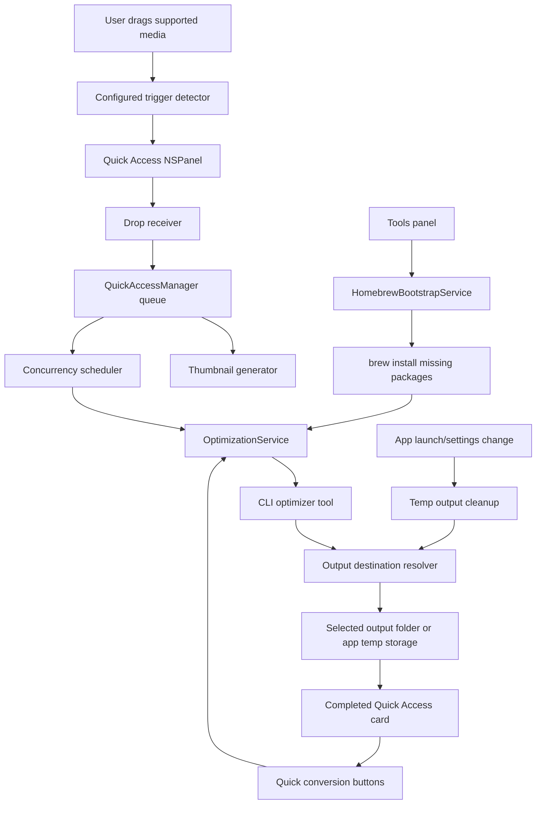

# Project Structure

This doc mirrors current Droplit code, not the old Snapzy source docs.

## Runtime Map



## Source Tree

```text
Droplit/
  App/
    AppDelegate.swift
    DroplitLaunchView.swift

  Features/
    Onboarding/
      OnboardingPermissions.swift
      OnboardingStep.swift
      OnboardingToolSetupView.swift
      OnboardingView.swift

    OutputSettings/
      OutputSettingsView.swift

    Settings/
      DroplitSettingsDetailView.swift
      DroplitSettingsSection.swift
      DroplitSettingsSharedViews.swift
      DroplitSettingsSidebarView.swift
      GeneralSettingsView.swift
      InfoSettingsView.swift
      QueueSettingsView.swift
      QuickAccessSettingsView.swift
      ToolsSettingsView.swift

    QuickAccess/
      Components/
        QuickAccessCardView.swift
        QuickAccessDropReceiverView.swift
        QuickAccessDropZoneCardView.swift
        QuickAccessExternalDragSource.swift
        QuickAccessStackView.swift
      Managers/
        QuickAccessManager.swift
        QuickAccessPanelController.swift
      Models/
        QuickAccessModels.swift
      Services/
        QuickAccessAnimations.swift
        QuickAccessShakeDetector.swift
        QuickAccessThumbnailGenerator.swift
      QuickAccessPanel.swift

  Services/
    Optimization/
      OptimizationOutputSettings.swift
      OptimizationService.swift
      OptimizationTemporaryFileStore.swift

  Support/
    ScreenUtility.swift

  ContentView.swift
  DroplitApp.swift

scripts/
  build_and_run.sh

docs/
  STRUCTURE.md
  DESIGN_TOKENS.md

.codex/
  environments/
    environment.toml
```

## Feature Roots

| Path | Owns |
| --- | --- |
| `App/` | App lifecycle, first-run launch gate, and launch-time service bootstrap |
| `Features/Onboarding/` | First-run welcome, required optimizer tool setup, optional permission setup, and completion transition |
| `Features/Settings/` | Main System Settings-style configuration shell, sidebar, detail pages, shared grouped rows |
| `Features/OutputSettings/` | Output destination toggle, folder picker, temp retention controls |
| `Features/QuickAccess/` | Floating stack, placeholder card, drag/drop, card visuals, trigger detection |
| `Services/Optimization/` | Local CLI tool resolution, Homebrew bootstrap, output destination resolution, temp cleanup, optimizer process execution |
| `Support/` | Small platform helpers |
| `docs/DESIGN_TOKENS.md` | Shared visual tokens and state treatment |

## Onboarding Flow

1. `DroplitApp` opens the main `WindowGroup`.
2. `DroplitLaunchView` reads `onboarding.isComplete` from `@AppStorage`.
3. The main window disables restoration so onboarding starts from the default 920 x 680 launch size instead of a stale saved frame.
4. If onboarding is incomplete, `OnboardingView` fills the window with a transparent native material surface and hides the toolbar/header.
5. Onboarding content is centered in a scrollable region with finite minimum window sizing, so smaller windows scroll content instead of forcing height.
6. The visible step sequence is Welcome, Tools, optional Permissions, then Ready.
7. The Permissions step is omitted when `OnboardingPermissions.requirements` is empty.
8. Tools setup uses `HomebrewBootstrapService.missingTools()` and blocks Continue until all optimizer tools are ready.
9. If Homebrew is available, the tool step can install missing packages through the existing Homebrew bootstrap service and shows package-level progress while setup runs.
10. A bottom-center dot indicator shows the current step while Back and Continue remain native footer controls.
11. The content is centered in the window; there is no onboarding sidebar or step rail.
12. Completing onboarding sets `onboarding.isComplete` and swaps the window into `ContentView`.
13. `ContentView` calls `QuickAccessManager.start()` on appear as an idempotent fallback after first-run onboarding completes.

## Quick Access Flow

1. `AppDelegate` performs launch activation, expired temporary output cleanup, and starts `QuickAccessManager` when onboarding is complete.
2. `ContentView` also calls `QuickAccessManager.start()` after onboarding transitions into the settings window, so the listener starts in the same session after first-run setup.
3. `QuickAccessManager` listens to local/global drag events.
4. `QuickAccessManager` checks the active drag pasteboard for supported optimizer payloads, then evaluates the configured trigger interaction.
   Default is shake via `QuickAccessShakeDetector`; hold starts a timer using the configured delay.
5. `QuickAccessPanelController` shows a non-activating floating `NSPanel`.
6. The panel position combines top/bottom edge with left/center/right alignment.
   Bottom placement anchors the stack to the lower edge and grows upward; top placement enters from the upper edge, anchors high, and grows downward.
   Top placement compensates for menu/notch safe area so the visual inset to the nearest Quick Access card edge matches bottom placement.
7. The placeholder stays pinned while the drag session is active.
8. If the user releases without dropping, the placeholder hides after a short grace period.
9. `QuickAccessDropReceiverView` caches pasteboard eligibility by `changeCount` during drag updates and avoids reading large inline data until drop.
10. On drop, `QuickAccessDropReceiverView` reads file URLs or image/PDF pasteboard data.
11. `QuickAccessManager` immediately inserts queued cards with placeholder thumbnails so the panel responds before thumbnail work finishes.
12. `QuickAccessThumbnailGenerator` builds real image/PDF thumbnails off the main path, while video thumbnails use async AVFoundation loading.
13. The concurrency scheduler starts up to the configured number of optimization jobs.
14. Extra jobs remain queued until an active job completes, fails, or is removed.
15. Removing a processing card cancels the Swift task and terminates the active optimizer process.
16. `OptimizationService` resolves the current output destination.
17. If Save location is on, output writes to the selected folder.
18. If Save location is off, output writes to Droplit app temp storage.
19. Temp outputs expire after the configured retention period, defaulting to 1 day and capped at 90 days.
20. Supported image and video cards show XS conversion buttons under the card.
21. Image conversion targets are PNG, JPEG, WebP, and HEIC.
22. Video/GIF conversion targets are GIF, MOV, and MP4.
23. Conversion actions always read `QuickAccessItem.sourceURL`, not the optimized output URL, so repeated switches do not chain from a compressed/downscaled derivative.
24. Swipe a Quick Access result card left or right to dismiss that card.
25. Drag a completed Quick Access card away from its dismiss direction to drop the optimized or converted output into external apps.
26. External card drag uses an AppKit `NSDraggingSession` with the output file URL as an `NSURL` pasteboard writer for broad Finder, native app, and browser compatibility.
27. Double-click a card to open the optimized or converted output, falling back to the source file when output is unavailable.
28. Completed Quick Access cards stay visible for 15 seconds, then auto-hide.
29. The floating Quick Access stack shows the newest cards plus an overflow summary when the queue is larger than the panel should display.

Output destination and retention are changed from main window Output configuration.
Parallel job count is changed from main window Concurrency configuration.

## Settings UI

1. `ContentView` owns the main configuration window shell, `NavigationSplitView`, search state, and file importer.
2. `DroplitSettingsSidebarView` renders the native source-list sidebar, including standalone About plus grouped Settings and Tool sections, and relies on split-view `searchable` for filtering.
3. `DroplitSettingsDetailView` switches between detail pages based on `DroplitSettingsSection`.
4. `DroplitSettingsPage` provides the shared heading plus scroll layout for every detail page.
5. `DroplitSettingsGroup`, `DroplitSettingsControlRow`, `DroplitSettingsValueRow`, and `DroplitSettingsAlignedRow` provide the shared native settings row treatment.
6. `InfoSettingsView` About is the default standalone landing page.
7. `QuickAccessSettingsView` owns Quick Access trigger, placement, preview, and concurrency controls.
8. `OutputSettingsView` owns save location, destination folder, temp retention, and conversion output behavior.
9. `ToolsSettingsView` owns optimizer status and Homebrew install action.
10. `QueueSettingsView` owns the Media Optimization status, remove actions, and file import entry point.
11. `InfoSettingsView` owns lightweight appearance, privacy, advanced settings, and the About identity/application details.

## Homebrew Bootstrap Flow

1. `ToolsSettingsView` renders optimizer availability from `OptimizationTool.catalog`.
2. `HomebrewBootstrapService` checks for `brew` in the local tool search paths.
3. If tools are missing, the Tools panel install action runs:

```text
brew install <missing-packages>
```

4. During install, callers can receive package-level progress for onboarding/status UI.
5. After install completes, the Tools panel refreshes availability state.

## Optimizer Mapping

| Input | Tool | Homebrew package |
| --- | --- | --- |
| PNG | `pngquant` | `pngquant` |
| JPEG | `jpegoptim` | `jpegoptim` |
| GIF | `gifsicle` | `gifsicle` |
| Video | `ffmpeg` | `ffmpeg` |
| PDF | `gs` | `ghostscript` |
| Other images | `vips` | `vips` |
| Image conversion | ImageIO framework, `vips` for WebP | Built in, `vips` |
| Video conversion | `ffmpeg` | `ffmpeg` |
| Video to GIF conversion | `gifski`, `ffmpeg` fallback | `gifski`, `ffmpeg` |
| GIF optimization | `gifsicle` | `gifsicle` |

## Notes

- The app intentionally disables App Sandbox for now so local optimizer binaries can execute.
- Missing optimizer binaries surface as failed Quick Access cards.
- Save location is off by default. Temp output storage lives under `~/Library/Application Support/Droplit/Temporary Outputs/`.
- App launch and retention changes trigger cleanup for expired temp outputs and inline dropped-source temp files.
- MOV/MP4 conversion tries stream-copy remux first to avoid quality loss, then falls back to high-quality H.264/AAC transcode if the source container or codecs cannot be copied.
- Optimizer stderr is written to a temporary log file instead of an undrained pipe, preventing verbose tools from blocking on full process pipes.
